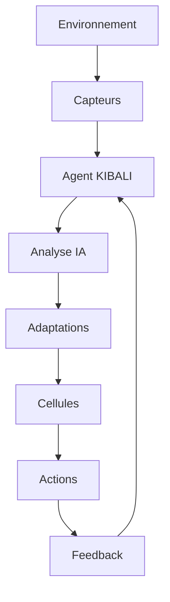

# 🤝 Guide de Contribution - Écosystème KIBALI

## Bienvenue dans la Communauté KIBALI ! 🌱

Nous sommes ravis que vous souhaitiez contribuer à l'écosystème KIBALI ! Ce guide vous explique comment participer au développement de cette intelligence artificielle révolutionnaire.

## 📋 Prérequis

### Connaissances Techniques
- **Python** : Maîtrise avancée (asyncio, typing, dataclasses)
- **IA/ML** : Transformers, PyTorch, quantification de modèles
- **Architecture** : Design patterns, systèmes distribués
- **Biologie** : Concepts écologiques et cellulaires

### Environnement de Développement
```bash
# Clone du repository
git clone https://github.com/kibali-ecosystem/kibali-langage.git
cd kibali-langage

# Installation des dépendances
pip install -r requirements.txt
pip install -r requirements-dev.txt

# Installation en mode développement
pip install -e .

# Téléchargement des modèles IA
python download_llm.py
```

## 🏗️ Architecture du Projet

### Structure des Modules

```
kibali-langage/
├── kibali/                 # Noyau du système
│   ├── core/              # Classes fondamentales
│   ├── ai/                # Intégration IA
│   ├── cells/             # Définition des cellules
│   └── ecosystem/         # Gestion écosystème
├── tools/                 # Outils de développement
├── tests/                 # Tests unitaires/intégration
├── docs/                  # Documentation
└── examples/              # Exemples d'utilisation
```

### Flux de Données



## 🚀 Comment Contribuer

### 1. Choisir une Issue

Visitez notre [tracker d'issues](https://github.com/kibali-ecosystem/kibali-langage/issues) et choisissez :

- **Issues `good first issue`** : Parfait pour débuter
- **Issues `help wanted`** : Contributions appréciées
- **Issues `enhancement`** : Améliorations fonctionnelles
- **Issues `bug`** : Corrections de bugs

### 2. Fork et Branch

```bash
# Fork le repository sur GitHub
# Clone votre fork
git clone https://github.com/VOTRE_USERNAME/kibali-langage.git
cd kibali-langage

# Créer une branche descriptive
git checkout -b feature/amazing-feature
# ou
git checkout -b fix/bug-description
# ou
git checkout -b docs/update-readme
```

### 3. Développement

#### Standards de Code

```python
# ✅ Bon exemple
from typing import List, Optional
from dataclasses import dataclass

@dataclass
class Cellule:
    """Représente une cellule dans l'écosystème."""
    nom: str
    type_cellule: str
    age: int = 0

    def evoluer(self, environnement: Environnement) -> Adaptation:
        """Fait évoluer la cellule selon l'environnement."""
        # Logique d'évolution
        pass

# ❌ Mauvais exemple
class cellule:  # Pas de majuscule
    def __init__(self, n, t):  # Paramètres non typés
        self.nom = n
        self.type = t

    def evolution(self, env):  # Pas de type hints
        pass  # Pas de docstring
```

#### Tests Obligatoires

```python
# tests/test_cellule.py
import pytest
from kibali.cells.cellule import Cellule

class TestCellule:
    def test_creation_cellule(self):
        cellule = Cellule(nom="Test", type_cellule="vegetal")
        assert cellule.nom == "Test"
        assert cellule.age == 0

    def test_evolution_cellule(self):
        cellule = Cellule(nom="Test", type_cellule="vegetal", age=1)
        environnement = Environnement(temperature=25)
        adaptation = cellule.evoluer(environnement)
        assert adaptation is not None
```

### 4. Commit et Push

```bash
# Vérifier les changements
git status
git diff

# Commits atomiques et descriptifs
git add .
git commit -m "feat: ajouter système d'évolution cellulaire

- Implémentation de l'algorithme d'évolution darwinienne
- Ajout des tests unitaires
- Mise à jour de la documentation

Closes #123"

# Push vers votre fork
git push origin feature/amazing-feature
```

### 5. Pull Request

1. **Allez sur GitHub** et créez une Pull Request
2. **Titre descriptif** : "feat: ajouter évolution cellulaire"
3. **Description détaillée** :
   ```markdown
   ## Description
   Implémentation du système d'évolution cellulaire avec algorithmes darwiniens.

   ## Changements
   - [x] Nouvelle classe `EvolutionEngine`
   - [x] Tests unitaires complets
   - [x] Documentation mise à jour

   ## Tests
   - [x] Tests passent localement
   - [x] Coverage > 90%

   ## Issues liées
   Closes #123
   ```

## 🧪 Tests et Qualité

### Exécution des Tests

```bash
# Tests unitaires
pytest tests/

# Tests avec coverage
pytest --cov=kibali --cov-report=html

# Tests d'intégration
pytest tests/integration/

# Tests de performance
pytest tests/performance/ -v
```

### Qualité du Code

```bash
# Linting
flake8 kibali/
black kibali/ --check
isort kibali/ --check-only

# Formatage automatique
black kibali/
isort kibali/

# Sécurité
bandit -r kibali/
safety check
```

### Benchmarks de Performance

```bash
# Benchmarks IA
python -m pytest tests/benchmarks/test_ai_performance.py -v

# Benchmarks écosystème
python -m pytest tests/benchmarks/test_ecosystem_scaling.py -v
```

## 📚 Types de Contributions

### 🐛 Corrections de Bugs

1. **Reproduire** le bug avec un test
2. **Corriger** le code
3. **Vérifier** que le test passe
4. **Tests de régression** pour éviter les rechutes

### ✨ Nouvelles Fonctionnalités

1. **Discussion** préalable sur l'issue
2. **Design** approuvé par les maintainers
3. **Implémentation** modulaire et testée
4. **Documentation** complète

### 📖 Documentation

1. **README** : Guides d'installation et d'usage
2. **Docstrings** : Documentation inline complète
3. **Examples** : Code d'exemple fonctionnel
4. **API Docs** : Documentation automatique

### 🎨 Améliorations UI/UX

1. **Interfaces** : Amélioration des CLI/web interfaces
2. **Visualisations** : Graphiques et dashboards
3. **Accessibilité** : Conformité WCAG

## 🔧 Outils de Développement

### Environnements Locaux

```bash
# Docker pour développement isolé
docker build -t kibali-dev .
docker run -it kibali-dev

# Environnements virtuels
python -m venv venv
source venv/bin/activate  # Linux/Mac
# ou
venv\Scripts\activate     # Windows
```

### Debugging

```python
# Configuration de logging
import logging
logging.basicConfig(
    level=logging.DEBUG,
    format='%(asctime)s - %(name)s - %(levelname)s - %(message)s',
    handlers=[
        logging.FileHandler('kibali_debug.log'),
        logging.StreamHandler()
    ]
)

# Profiling de performance
from pyinstrument import Profiler
profiler = Profiler()
profiler.start()
# Code à profiler
profiler.stop()
profiler.print()
```

### CI/CD

Notre pipeline CI/CD vérifie automatiquement :
- ✅ Tests unitaires
- ✅ Linting et formatage
- ✅ Sécurité
- ✅ Performance
- ✅ Coverage

## 🎯 Bonnes Pratiques

### Code
- **SOLID Principles** : Principes de conception orientée objet
- **DRY** : Don't Repeat Yourself
- **KISS** : Keep It Simple, Stupid
- **YAGNI** : You Aren't Gonna Need It

### Git
- **Commits atomiques** : Un changement logique par commit
- **Messages descriptifs** : Expliquent le pourquoi, pas juste le quoi
- **Branches éphémères** : Une branche par fonctionnalité
- **Rebase interactif** : Nettoyer l'historique avant merge

### Communication
- **Issues détaillées** : Description complète du problème/solution
- **Reviews constructives** : Feedbacks utiles et respectueux
- **Documentation** : Tout changement documenté
- **Tests** : Tout code testé

## 🏆 Reconnaissance

### Niveaux de Contributeurs

- **🥉 Contributor** : Premier commit mergé
- **🥈 Regular Contributor** : 10+ commits
- **🥇 Core Contributor** : Contributions significatives
- **👑 Maintainer** : Accès en écriture, reviews

### Récompenses

- **Mentions** dans les releases
- **Badges** sur le profil GitHub
- **Invitations** aux discussions stratégiques
- **Swag** virtuel et réel

## 📞 Support

### Canaux de Communication

- **Issues GitHub** : Bugs et features
- **Discussions** : Questions générales
- **Discord** : Chat communautaire
- **Email** : maintainers@kibali-ecosystem.org

### Code de Conduite

Nous nous engageons à fournir un environnement accueillant et respectueux. Tout comportement harcelant sera sanctionné.

## 🙏 Remerciements

Merci de contribuer à l'écosystème KIBALI ! Votre travail aide à créer l'avenir de l'intelligence artificielle autonome.

---

*Ce guide évolue avec la communauté. Vos suggestions sont les bienvenues !*