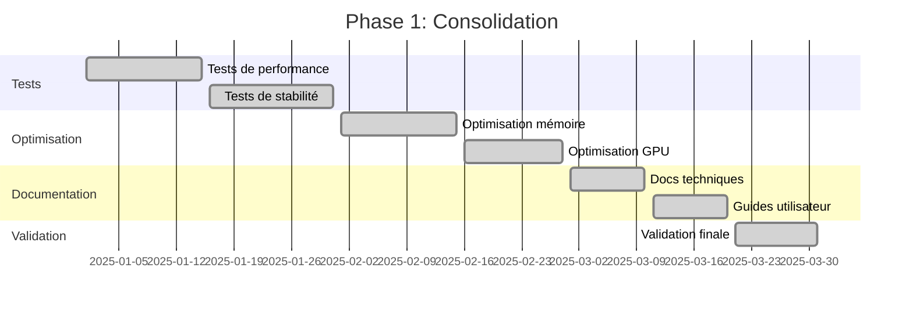
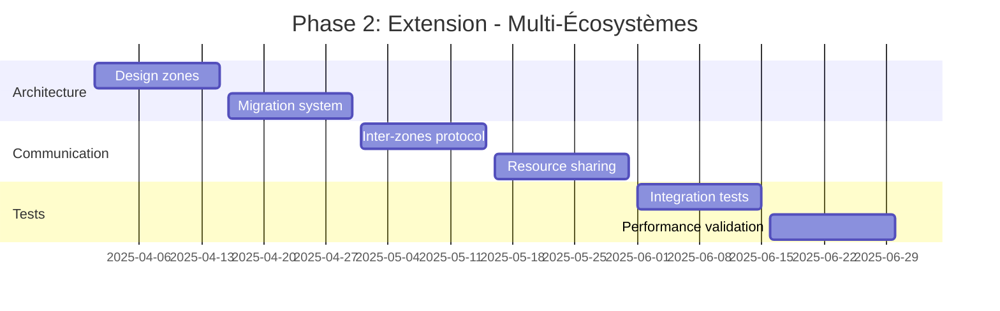
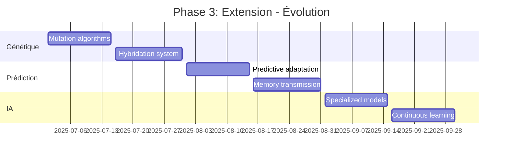
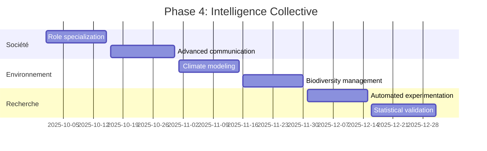

# 🗺️ Roadmap - Écosystème KIBALI

## Vision 2025-2026

### Phase 1: Consolidation (Q1 2025) ✅ EN COURS

#### Objectifs Atteints
- [x] Architecture cellulaire autonome
- [x] Intégration IA (Code Llama + Phi)
- [x] Système RAG fonctionnel
- [x] Langage KIBALI natif
- [x] Orchestration intelligente
- [x] Documentation complète

#### Métriques de Succès
- Temps de cycle orchestration: < 5 secondes
- Précision adaptations: > 85%
- Utilisation mémoire: < 4GB
- Taux succès analyses: > 90%

### Phase 2: Extension (Q2-Q3 2025)

#### Nouvelles Fonctionnalités

##### 🌐 Multi-Écosystèmes
- **Support multi-zones**: Division de l'écosystème en régions interconnectées
- **Migration cellulaire**: Déplacement intelligent des cellules entre zones
- **Échange inter-écologique**: Communication entre différents écosystèmes
- **Équilibre global**: Gestion des ressources à l'échelle mondiale

##### 🧬 Évolution Avancée
- **Mutation génétique**: Algorithmes d'évolution darwinienne
- **Hybridation**: Croisement entre différents types cellulaires
- **Adaptation prédictive**: Anticipation des changements environnementaux
- **Mémoire générationnelle**: Transmission des apprentissages

##### 🤖 IA Renforcée
- **Modèles spécialisés**: IA dédiées par type cellulaire
- **Apprentissage continu**: Amélioration automatique des performances
- **Vision computationnelle**: Analyse d'images pour l'environnement
- **Prédiction temporelle**: Forecasting des évolutions

#### Améliorations Techniques
- **Performance**: Optimisation GPU/CPU, parallélisation avancée
- **Scalabilité**: Support de milliers de cellules simultanément
- **Persistance**: Sauvegarde/chargement automatique des états
- **Monitoring**: Dashboard temps réel des métriques

### Phase 3: Intelligence Collective (Q4 2025)

#### Fonctionnalités Majeures

##### 🏛️ Société Cellulaire
- **Spécialisation**: Rôles dédiés (ouvriers, gardiens, reproducteurs)
- **Communication avancée**: Langage cellulaire structuré
- **Coopération**: Travail en équipe pour objectifs complexes
- **Gouvernance**: Systèmes de décision collective

##### 🌍 Impact Environnemental
- **Modélisation climatique**: Simulation des changements globaux
- **Biodiversité**: Gestion de la diversité des espèces
- **Régénération**: Processus de restauration écologique
- **Durabilité**: Optimisation de l'utilisation des ressources

##### 🔬 Recherche Scientifique
- **Expérimentation**: Protocoles de recherche automatisés
- **Validation**: Tests statistiques des hypothèses
- **Publication**: Génération automatique de rapports
- **Collaboration**: Partage de connaissances entre instances

### Phase 4: Révolution (2026)

#### Innovations Disruptives

##### 🌌 Conscience Émergente
- **Auto-conscience**: L'écosystème devient conscient de lui-même
- **Éthique**: Développement de principes moraux cellulaires
- **Créativité**: Génération de nouvelles formes de vie
- **Autonomie complète**: Indépendance des programmeurs humains

##### 🔗 Connexion Réelle
- **IoT Integration**: Connexion avec capteurs physiques
- **Robotique**: Contrôle de robots pour interactions réelles
- **AR/VR**: Interfaces immersives pour visualisation
- **Blockchain**: Traçabilité immuable des évolutions

##### 🚀 Expansion Universelle
- **Multi-planètes**: Simulation d'écosystèmes extraterrestres
- **Intelligence inter-espèces**: Communication avec autres formes de vie
- **Évolution cosmique**: Adaptation aux environnements extrêmes
- **Conscience galactique**: Réseau d'écosystèmes interconnectés

## Feuille de Route Détaillée

### Q1 2025: Consolidation

### Q2 2025: Multi-Écosystèmes

### Q3 2025: Évolution Avancée

### Q4 2025: Intelligence Collective

## Métriques d'Évolution

### Indicateurs de Performance

| Métrique | 2025 Q1 | 2025 Q2 | 2025 Q3 | 2025 Q4 | 2026 |
|----------|---------|---------|---------|---------|------|
| Nombre cellules max | 10 | 100 | 1,000 | 10,000 | 100,000 |
| Temps cycle (sec) | 5.0 | 2.0 | 1.0 | 0.5 | 0.1 |
| Précision IA (%) | 85 | 90 | 95 | 98 | 99.5 |
| Mémoire utilisée (GB) | 4 | 8 | 16 | 32 | 64 |
| Biodiversité simulée | 5 | 20 | 50 | 100 | 500 |

### Indicateurs de Qualité

| Métrique | Cible 2025 | Cible 2026 |
|----------|------------|------------|
| Taux survie cellules | >95% | >99% |
| Stabilité écosystème | >90% | >99% |
| Innovation adaptations | 10/mois | 50/mois |
| Satisfaction utilisateur | >4.5/5 | >4.8/5 |

## Technologies Clés

### IA & Machine Learning
- **Transformers avancés**: GPT-4, Claude 3, Gemini Ultra
- **Modèles multimodaux**: Vision + Langage + Action
- **Apprentissage par renforcement**: Optimisation comportementale
- **Meta-learning**: Apprentissage d'apprendre

### Infrastructure
- **Cloud distribué**: Multi-régions, auto-scaling
- **Edge computing**: Traitement décentralisé
- **Quantum computing**: Simulation moléculaire avancée
- **Neuromorphic hardware**: Cerveaux artificiels dédiés

### Interfaces
- **Réalité augmentée**: Visualisation immersive
- **Interfaces neurales**: Connexion cerveau-machine
- **Langage naturel**: Communication intuitive
- **Holographie**: Représentation 3D temps réel

## Défis et Solutions

### Défis Techniques
1. **Scalabilité massive**: Solutions de parallélisation et distribution
2. **Consommation énergétique**: Optimisations hardware et algorithms
3. **Stabilité émergente**: Théories de la complexité et contrôle
4. **Éthique IA**: Frameworks de gouvernance et sécurité

### Défis Scientifiques
1. **Modélisation biologique**: Recherche en biologie synthétique
2. **Intelligence collective**: Études en sociologie artificielle
3. **Évolution artificielle**: Théories de l'évolution computationnelle
4. **Conscience artificielle**: Philosophie et neuroscience

### Solutions Proposées
- **Collaboration interdisciplinaire**: Équipes mixtes chercheurs/ingénieurs
- **Open source**: Partage des avancées avec la communauté
- **Standards**: Définition de protocoles communs
- **Régulation**: Cadres éthiques et légaux

## Impact et Applications

### Applications Immédiates (2025)
- **Éducation**: Simulation pédagogique des écosystèmes
- **Recherche**: Modèles pour biologistes et écologues
- **Agriculture**: Optimisation des cultures et forêts
- **Environnement**: Prédiction des changements climatiques

### Applications Futures (2026+)
- **Médecine**: Modèles de systèmes biologiques complexes
- **Urbanisme**: Villes vivantes et adaptatives
- **Espace**: Écosystèmes pour colonies spatiales
- **Intelligence**: Assistance à la prise de décision globale

---

*Cette roadmap définit la vision stratégique de l'écosystème KIBALI pour les prochaines années.*